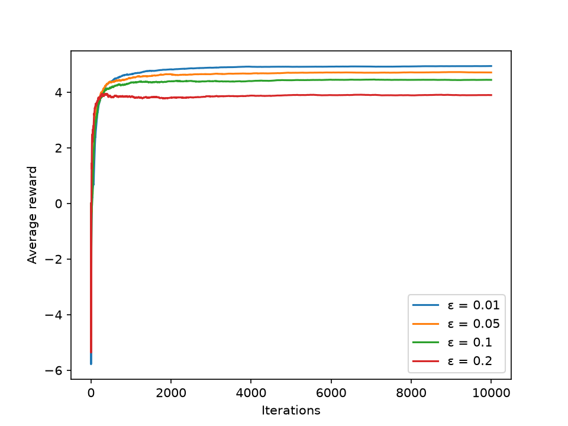

# 实验报告
## 对于特定代码的解释

```py
eps = epsilon * len(values) / (len(values) - 1)
```

对于这行代码，理解如下：按照标准的定义，我们有$\epsilon$的概率随机选择一个臂（这里包含所有的臂），有$1-\epsilon$的概率选择最优的臂，这行代码的作用是对于$\epsilon$进行矫正，使得选择最优的臂的概率确实是$1-\epsilon$

## 实验设置

11 臂 bandit，第 $k$ 个臂的奖励服从 $\mathcal{N}(k-5, 1)$（均值 $-5\sim 5$，标准差均为 1）；每种 $\epsilon$ 独立运行 10000 步，记录平均奖励曲线。

## 实验结果



$\epsilon$可以被视为是探索利用平衡中探索的强度，它越大，代表agent越倾向于去探索新的选项而不是利用已有的最大值。从结果上来看，随着$\epsilon$增大，最终的平均收益反倒越来越小。这并非因为探索过强找不到全局最优臂——每个臂都会被无限次拉动，价值估计$\hat Q$依然收敛到真实均值——而是因为策略始终以$\epsilon$的概率把拉动浪费在随机的非最优臂上。

这一渐近收益可以定量验证：价值估计收敛后，最优臂（均值 5）以$1-\epsilon$的概率被选中，其余臂合计以$\epsilon$的概率被选中，而所有臂的均值之和为 0，故

$$\bar R = (1-\epsilon)\cdot 5 + \epsilon \cdot 0 = 5(1-\epsilon)$$

$\epsilon=0.01/0.05/0.1/0.2$ 分别对应 $\bar R\approx 4.95/4.75/4.5/4.0$，与图中四条曲线的平台高度次序吻合。

另一方面，$\epsilon$越大，曲线初期下探越深（探索更多次优臂），但能更快识别最优臂、收敛更快；$\epsilon=0.01$探索不足，收敛最慢。因此$\epsilon$过小会导致收敛缓慢，过大则损害长期收益，本任务中$\epsilon=0.05$左右能较好兼顾收敛速度与最终收益。

（注：图中为单次运行结果，存在随机波动；多次重复取平均可得到更平滑的曲线。）