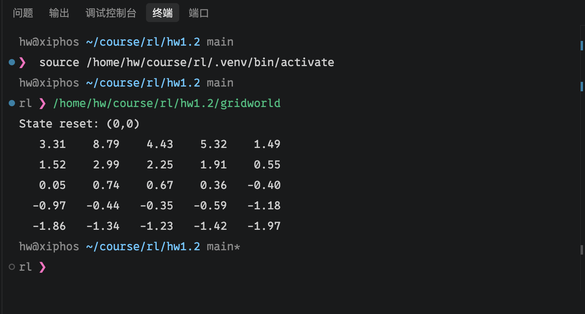

# Gridworld实验报告

## 1. 问题描述

Gridworld（Sutton《Reinforcement Learning: An Introduction》P60，5×5 网格世界）：

- 状态为网格坐标 $(x, y)$，$x, y \in \{0, 1, 2, 3, 4\}$，共 25 个状态；动作为上（NORTH）、下（SOUTH）、右（EAST）、左（WEST）四个方向。
- 特殊状态 $A=(1, 0)$：执行任意动作都跳转到 $A'=(1, 4)$，奖励 $+10$。
- 特殊状态 $B=(3, 0)$：执行任意动作都跳转到 $B'=(3, 2)$，奖励 $+5$。
- 撞墙（动作导致越界）：位置不变，奖励 $-1$。
- 其余普通移动：奖励 $0$。
- 折扣因子 $\gamma = 0.9$。

任务：使用动态规划算法（迭代策略评估），求解**等概率随机策略** $\pi(a \mid s) = 0.25$ 下所有状态的价值 $v_\pi(s)$，并按矩阵形式输出（保留两位小数）。

## 2. 算法原理

### 2.1 Bellman 期望方程

状态价值函数定义为折扣回报的期望：

$$v_\pi(s) = \mathbb{E}_\pi\left[\sum_{k=0}^{\infty} \gamma^k R_{t+k+1} \,\middle|\, S_t = s\right]$$

对固定策略 $\pi$，$v_\pi$ 满足 Bellman 期望方程：

$$v_\pi(s) = \sum_a \pi(a \mid s) \sum_{s', r} p(s', r \mid s, a)\left[r + \gamma v_\pi(s')\right]$$

本环境中状态转移是**确定性的**，因此对每个动作只有一个后继状态 $(s', r)$，方程简化为：

$$v_\pi(s) = \frac{1}{4}\sum_a \left[r(s, a) + \gamma\, v_\pi\big(s'(s, a)\big)\right]$$

### 2.2 迭代策略评估

将 Bellman 期望方程作为更新规则反复迭代：

$$v_{k+1}(s) \leftarrow \frac{1}{4}\sum_a \left[r(s, a) + \gamma\, v_k\big(s'(s, a)\big)\right], \quad \forall s$$

初值 $v_0(s) = 0$。由压缩映射性质，$v_k$ 收敛到唯一不动点 $v_\pi$。当一次全量扫描中所有状态价值的最大变化量

$$\Delta = \max_s |v_{k+1}(s) - v_k(s)|$$

小于阈值 $\theta = 10^{-4}$ 时停止迭代。

代码采用**原地更新**（Gauss–Seidel 风格）：更新 $v(s)$ 时，部分后继状态使用的已是本轮的新值。这不改变收敛的不动点，且通常收敛更快。

### 2.3 算法伪代码

采用 Sutton 书中迭代策略评估的标准伪代码（P75）：

```text
Iterative Policy Evaluation, for estimating V ≈ v_π

Input π, the policy to be evaluated
Algorithm parameter: a small threshold θ > 0 determining accuracy of estimation
Initialize V(s) = 0, for all s ∈ S

Loop:
    Δ ← 0
    Loop for each s ∈ S:
        v ← V(s)
        V(s) ← Σ_a π(a|s) Σ_{s',r} p(s',r|s,a) [r + γ V(s')]
        Δ ← max(Δ, |v − V(s)|)
until Δ < θ
```

其中 $\pi(a \mid s) = 1/4$，$\gamma = 0.9$，$\theta = 10^{-4}$；本环境转移确定，内层对 $(s', r)$ 的求和只剩一项，$(s', r)$ 由 2.1 节的转移规则（特殊状态跳转、撞墙、普通移动）决定。

## 3. 实现说明

代码见 [gridworld.cpp](gridworld.cpp)，主要结构：

- `GridWorld` 类：封装网格世界环境。`state_transition(action)` 实现三类转移规则（特殊状态跳转、撞墙、普通移动）；`step(action)` 返回 $(s', r)$。作业要求计算价值无需真实交互，这里仅将环境用作**转移与奖励的查询接口**，等价于枚举确定性转移。
- `main()`：迭代策略评估主循环。对每个状态依次计算 4 个动作的 Bellman 期望更新，扫描至 $\Delta < 10^{-4}$。
- `print_v_table()`：按 $y$ 为行、$x$ 为列以矩阵形式输出价值表，保留两位小数。

编译运行：

```bash
g++ -o gridworld gridworld.cpp
./gridworld
```

## 4. 实验结果

运行截图：

