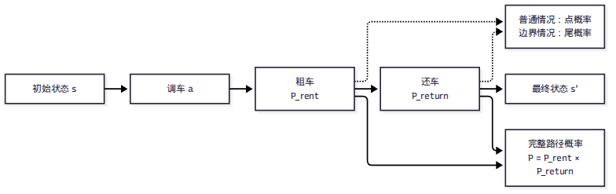
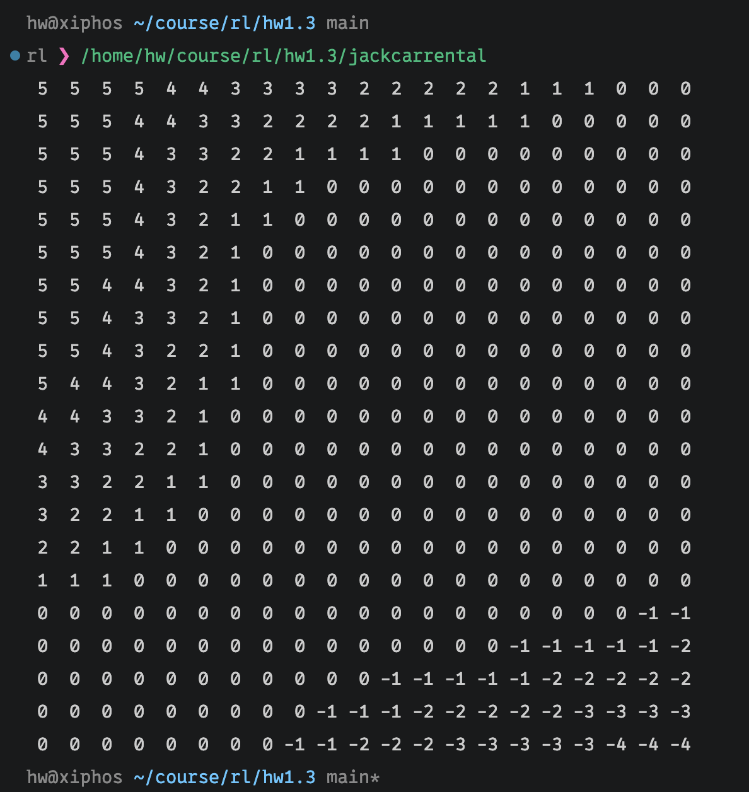

# Jack 汽车租赁策略迭代实验报告

## 1. 问题描述

本实验求解 Sutton & Barto《Reinforcement Learning》P81 的 Jack 汽车租赁问题。Jack 管理两个租车地点，每个地点最多存放 20 辆车。每天晚上可以在两个地点之间调动车辆，最多调动 5 辆，每辆车的调车成本为 2。第二天两个地点分别产生租车请求和还车数量，均服从相互独立的泊松分布：

- 地点 1：租车请求均值为 3，还车均值为 3；
- 地点 2：租车请求均值为 4，还车均值为 2。

每租出一辆车获得 10 的收益。状态为两个地点的车辆数 `(car_1, car_2)`，动作 `a` 表示调动车辆数：`a > 0` 表示从地点 1 调往地点 2，`a < 0` 表示从地点 2 调往地点 1。

## 2. 策略迭代算法

状态空间为 `21 × 21`，即每个地点的车辆数为 0 到 20。对给定状态和动作，先确定性地完成调车，再分别枚举两个地点的租车后库存和还车后库存。

若租车请求为 `R`、还车数量为 `D`，则单个地点的库存转移为：

$$
n_{\mathrm{rent}}=\max(n-R,0),\qquad
n_{\mathrm{return}}=\min(n_{\mathrm{rent}}+D,20).
$$

每种随机事件的概率由泊松分布计算。两个地点相互独立，因此联合概率等于两个地点概率的乘积。对状态 `s` 和动作 `a`，动作价值为：

$$
Q(s,a)=\mathbb{E}\left[r+\gamma V(s')\mid s,a\right],
$$

其中当天奖励为租车收入减去调车成本，折扣因子取 $\gamma = 0.9$。

### 分阶段计算状态转移概率

程序没有直接一次性计算“从当天初始状态到第二天最终状态”的概率，而是按照实际经营过程分成三个步骤：

1. **调车阶段**：给定状态 `s` 和动作 `a` 后，车辆调配是确定性的，得到调车后的状态
   `moved_state`，因此该阶段不需要额外乘随机概率；
2. **租车阶段**：分别计算两个地点从调车后库存变为租车后库存的概率；
3. **还车阶段**：以租车后的中间状态为起点，分别计算两个地点从租车后库存变为还车后最终库存的概率。

整个状态转移过程及概率计算关系如下：

设调车后状态为 `(m_1,m_2)`，租车后的中间状态为
`(r_1,r_2)`，还车后的最终状态为 `(n_1,n_2)`。则在地点 1，租车请求和库存变化满足：

$$
r_1=\max(m_1-R_1,0),
$$

因此可以由泊松分布得到单地点概率
`P_1^{rent}(m_1,r_1)`；地点 2 同理得到
`P_2^{rent}(m_2,r_2)`。由于两个地点的租车请求相互独立，租车阶段的联合概率为：

$$
P_{\mathrm{rent}}\big((r_1,r_2)\mid(m_1,m_2)\big)
=P_1^{rent}(m_1,r_1)\,
 P_2^{rent}(m_2,r_2).
$$

这里需要区分泊松**点概率**和**尾概率**。如果库存变化对应唯一的请求或还车数量，就使用泊松点概率：

$$
P(X=k)=e^{-\lambda}\frac{\lambda^k}{k!}.
$$

例如，租车后库存从 `m` 变为一个严格大于 0 的 `r`，说明请求数量恰好为
`m-r`，因此：

$$
P^{rent}(m,r)=P(R=m-r).
$$

同理，还车后库存从 `r` 变为一个严格小于 20 的 `n`，说明还车数量恰好为
`n-r`，因此：

$$
P^{return}(r,n)=P(D=n-r).
$$

本模型的库存被截断在区间 `[0,20]`，这正是需要使用尾概率的根本原因。
当随机请求或还车数量超过库存边界后，超出的部分不会继续产生新的库存状态，
而是与其他事件一起被截断并映射到同一个边界状态。因此，边界状态对应的是多个
随机事件的概率之和，不能只使用某一个点概率。

租车时，库存下界为 0。如果请求数量大于等于当前库存，截断后的库存都会变为 0，
因此需要把这些请求数量的概率合并为右尾概率：

$$
P^{rent}(m,0)=P(R\ge m)
=1-\sum_{k=0}^{m-1}P(R=k).
$$

还车时，库存上界为 20。如果还车数量大于等于剩余容量，截断后的库存都会变为 20，
因此同样需要使用右尾概率：

$$
P^{return}(r,20)=P(D\ge 20-r)
=1-\sum_{k=0}^{19-r}P(D=k).
$$

因此，尾概率是由库存状态空间的边界截断产生的，而不是把普通的点概率公式改变了。
程序中的 `inventory_transition_probability` 对一般状态调用
`poisson_probability` 计算点概率，对租车到 0 或还车到 20 的边界状态调用
`poisson_tail_probability` 计算尾概率。这样既能正确处理库存截断，也能保证每个库存转移矩阵的概率质量完整。

接着，以 `(r_1,r_2)` 作为还车阶段的初始库存。若还车数量分别为
`D_1,D_2`，则：

$$
n_1=\min(r_1+D_1,20),\qquad
n_2=\min(r_2+D_2,20).
$$

程序分别计算两个地点的还车转移概率
`P_1^{return}(r_1,n_1)` 和 `P_2^{return}(r_2,n_2)`。由于还车数量也相互独立，还车阶段的联合概率为：

$$
P_{\mathrm{return}}\big((n_1,n_2)\mid(r_1,r_2)\big)
=P_1^{return}(r_1,n_1)\,
 P_2^{return}(r_2,n_2).
$$

因此，一条完整的“租车后中间状态 + 还车后最终状态”的路径概率，是先分别得到两个阶段的联合概率，再将两个阶段相乘：

$$
\begin{aligned}
P\big((r_1,r_2),(n_1,n_2)\mid s,a\big)
={}&P_{\mathrm{rent}}\big((r_1,r_2)\mid(m_1,m_2)\big)\\
&\times P_{\mathrm{return}}\big((n_1,n_2)\mid(r_1,r_2)\big).
\end{aligned}
$$

展开后就是四个单地点、单阶段概率的乘积：

$$
\begin{aligned}
P={}&P_1^{rent}(m_1,r_1)\,
P_2^{rent}(m_2,r_2)\\
&\times P_1^{return}(r_1,n_1)\,
P_2^{return}(r_2,n_2).
\end{aligned}
$$

代码中的 `expected_action_value` 先计算租车阶段的联合概率
`rental_probability_1 * rental_probability_2`，再使用预先计算的
`continuation_value` 汇总还车阶段：

$$
C(r_1,r_2)=
\gamma\sum_{n_1,n_2}
P_1^{return}(r_1,n_1)
P_2^{return}(r_2,n_2)V(n_1,n_2).
$$

所以动作价值可以写成：

$$
Q(s,a)=
\sum_{r_1,r_2}
P_1^{rent}(m_1,r_1)P_2^{rent}(m_2,r_2)
\left[
r(r_1,r_2,a)+C(r_1,r_2)
\right].
$$

这种写法既保留了“每个步骤分别计算概率、再利用独立性相乘”的完整逻辑，也避免在每次动作评估时重复枚举还车阶段的相同概率。

算法从全零策略开始，交替进行：

1. **策略评估**：固定当前策略，反复使用贝尔曼期望方程更新 `V(s)`，直到最大变化量小于 `10^{-4}`；
2. **策略改进**：对每个状态遍历所有合法动作，选择 `Q(s,a)` 最大的动作更新策略。

为了提高运行速度，程序预先计算四张单地点库存转移概率表，并缓存从租车后中间状态出发的还车阶段未来价值。这样可以避免在每次动作评估中重复计算相同的概率和还车状态。

## 3. 实验结果

最终策略矩阵中，行表示地点 1 的车辆数从 20 到 0，列表示地点 2 的车辆数从 0 到 20。矩阵元素为最优调车动作，正数表示地点 1 向地点 2 调车，负数表示地点 2 向地点 1 调车。

程序运行结果如下：

可以观察到，地点 2 的租车请求均值较高，而地点 1 的还车均值相对更高，因此在地点 1 车辆较多、地点 2 车辆较少时，策略倾向于选择正动作，将车辆从地点 1 调往地点 2；反之则可能选择负动作。两个地点车辆数量都较充足时，调车动作通常为 0，因为额外调车成本不能带来足够的租车收益。

程序在优化后能够在较短时间内完成策略评估和策略改进，并输出稳定的 `21 × 21` 最优策略矩阵。